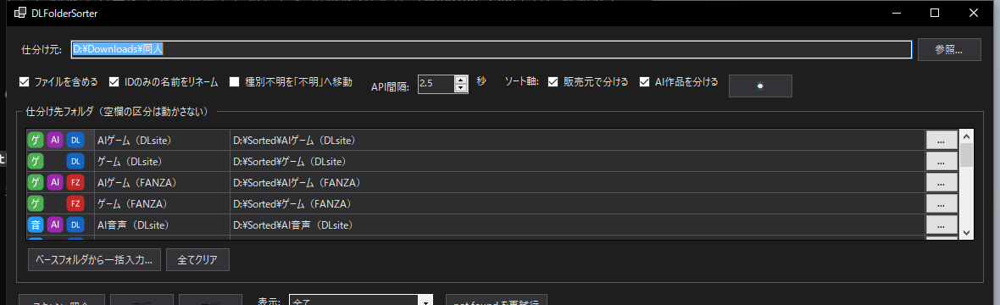

# DLFolderSorter

DLsite / FANZA の同人作品アーカイブ（zip / rar / フォルダ / 動画ファイル）を、作品種別ごとのフォルダへ自動仕分けする Windows アプリです。

ファイル名・フォルダ名から作品ID（RJ番号・FANZA cid・AV品番）を抽出し、公式サイトの情報から「ゲーム / 音声 / 動画 / CG・マンガ / AV」を判定して、指定フォルダへ安全に移動・リネームします。



## 主な機能

- **作品種別の自動判定**
  - DLsite: product.json API の作品形式（全21種を4カテゴリに集約）
  - FANZA同人: 作品ページのカテゴリ（コミック / CG / ゲーム / ボイス）
  - FANZA AV: DMM横断検索によるフロア逆引き（cid形式・品番形式の両対応）
- **ソート軸の組み合わせ**: カテゴリ × 販売元（DLsite / FANZA）× AI生成作品 を独立に切り替え可能。仕分け先は有効な区分だけが表に並び、ベースフォルダから一括入力もできます
- **実行前プレビュー**: 全対象の移動先・新名前・スキップ理由を一覧確認してから実行。行単位で除外可能
- **リネーム**: IDしか含まない名前を `[RJ番号] [サークル名] 作品名` 形式に更新（バージョン表記などのサフィックスは温存、`.part1.rar` 等の分割書庫も一貫して処理）
- **安全設計**
  - 同一ドライブ内は原子的な移動、別ドライブへは「コピー → 検証 → 削除」+ 空き容量の事前チェック
  - 宛先の既存ファイルは上書きしない（衝突はスキップして理由を表示）
  - 1件ごとに追記されるCSVログ（実行履歴 = 手動で戻すためのレシピ）
  - ドライブ切断・連続エラー時の自動中断。再実行すると処理済み分をスキップして続きから再開
- **API負荷への配慮**: 照会は既定2.5秒間隔+ジッター、結果はローカルにキャッシュ（再実行時は照会なし）
- ダークモード対応

## 使い方

1. 仕分け元フォルダを指定（直下のファイル・フォルダが対象。サブフォルダの中までは辿りません）
2. ソート軸（販売元 / AI）と、区分ごとの仕分け先フォルダを設定（空欄の区分は動かしません）
3. **スキャン+照会** → プレビューを確認 → **実行**

種別が判定できない作品（削除済み・ID無しなど）は既定では元の場所に残ります。「種別不明を『不明』へ移動」をONにすると不明フォルダへ隔離できます。

## ビルド

```
dotnet build -c Release
```

- .NET 8 / Windows
- [DLsiteInfoGetter](https://github.com/dekotan24/DLsiteInfoGetter) v1.5.2以降が `..\DLsiteInfoGetter` に必要です（ProjectReference）

## 構成

| プロジェクト | 内容 |
|---|---|
| `DLFolderSorter.Core` | 仕分けロジック（ID抽出・照会・計画・実行）。UI非依存 |
| `DLFolderSorter` | WinForms UI |
| `DLFolderSorter.Core.Tests` | ユニットテスト（xUnit） |

## 注意

- DLsite / FANZA への問い合わせは常識的な間隔で行われますが、大量の作品を初回スキャンする際は相応の時間がかかります（1作品あたり約2.5秒）
- FANZA AVはフロア判定（AVフォルダへの振り分け）のみ対応で、タイトル取得・リネームは未対応です

## License

MIT
